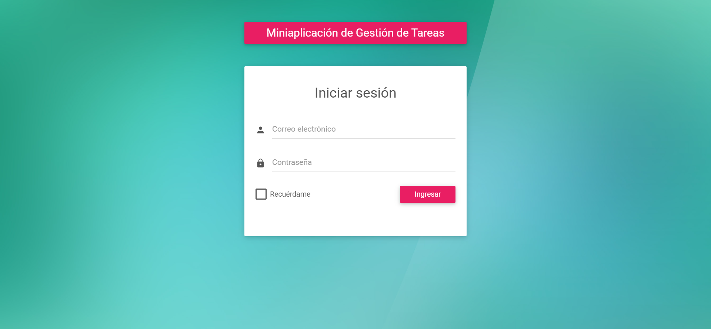
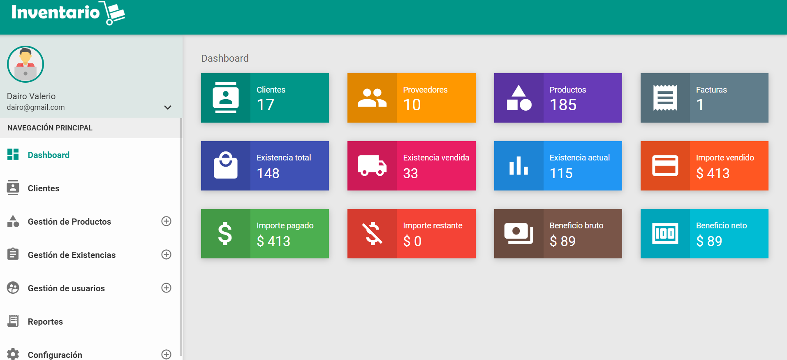

#  Miniaplicación de Gestión de Tareas

<!-- Basicamente es sencillo de entender , es un invertario a su ves esta gestionando tarea -->

<!-- Para logearte dairo@gmail.com clave= 1234
    ya una vez detro puedes crear el usuario que quiero y depende del usuario tendras algunos permisos, recordar que con esta version de laravel fue con la que trabaje
    php-7.4.33-Win32-vc15-x64.zip)
 -->

 <!-- Necesario para su funcionamiento 
* https://code.visualstudio.com/download
* https://git-scm.com/downloads
* https://laragon.org/download/index.html
* al instalar laragon deber tambien crear la tabla , deje todo lo necesario para ello en la carpeta llamada DB
* https://windows.php.net/downloads/rel...
* (link actualizado - php-7.4.33-Win32-vc15-x64.zip) -->

<!-- 
Paso 1: Configuración Inicial
Configurar un entorno de desarrollo local con PHP, Laravel, Composer y MySQL.
Crear un nuevo proyecto Laravel con el siguiente comando en la terminal:
composer create-project --prefer-dist laravel/laravel task-manager-app

Navegar al directorio del proyecto:
cd task-manager-app

Paso 2: Crear la Base de Datos
Crear una base de datos MySQL para la aplicación (por ejemplo, task_manager_db).

Paso 3: Crear el Modelo y la Migración
Crear el modelo y la migración para la tabla tasks con el siguiente comando:
php artisan make:model Task -m

Abrir el archivo de migración en database/migrations y definir la estructura de la tabla tasks. Agregar campos como title, description, status, y created_at.

Paso 4: Ejecutar las Migraciones
Ejecutar las migraciones para crear la tabla tasks en la base de datos:
php artisan migrate

Paso 5: Crear las Rutas y Controladores
Crear las rutas para las operaciones CRUD en el archivo routes/web.php.
Crear un controlador para manejar las operaciones CRUD con el siguiente comando:

php artisan make:controller TaskController -->